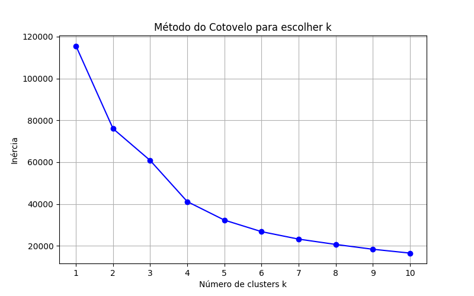

## Objetivo

Realizar uma análise exploratória e aplicar o algoritmo de **K-means clustering** utilizando a base de dados **FIFA World Ranking (1993–2018)** disponível no Kaggle. O foco está em identificar grupos de seleções com comportamentos semelhantes em relação aos pontos anteriores e à variação no ranking.


### Tarefa 1 - Exploração dos Dados

Foi utilizado o dataset contendo os rankings oficiais da FIFA de 1993 até 2024.

Colunas principais:
 - **rank**: posição da seleção no ranking  

 - **country_full**: nome da seleção  

 - **country_abrv**: abreviação de 3 letras  

 - **total_points**: pontos acumulados  

 - **previous_points**: pontos da edição anterior  

 - **rank_change**: variação de posição em relação ao ranking anterior  

 - **confederation**: confederação (UEFA, CONMEBOL, CAF, AFC, CONCACAF, OFC)  

 - **rank_date**: data do ranking  

Estatísticas descritivas:
- `rank`: varia entre 1 e mais de 200, média próxima de 90  

- `total_points`: entre ~700 e 2000 pontos  

- `rank_change`: geralmente entre -5 e +5  

- `confederation`: maior número de seleções pertencem à UEFA  

---

### Tarefa 2 - Pré-processamento

- Remoção de valores ausentes  

```python exec="0"
df = df.dropna()
```

- Seleção das features para clustering

```python exec="0"
X_vis = df[["previous_points", "rank_change"]].copy()
```

- Criação da variável-alvo `faixa_rank`, agrupando posições em 5 faixas:  
  - 1 a 50  
  - 51 a 100  
  - 101 a 150  
  - 151 a 200  
  - acima de 200 

``` python exec="0"
y = pd.cut(df["rank"], bins=[0,50,100,150,200,300],
           labels=[1,2,3,4,5])
```

- Normalização das features para evitar influência de escalas diferentes:
``` python exec="0"
from sklearn.preprocessing import StandardScaler
scaler = StandardScaler()
X_vis_scaled = scaler.fit_transform(X_vis)
```

## Tarefa 3 - Divisão dos Dados

Foi aplicado o método do cotovelo para definir o valor de k. Esse método avalia a inércia (soma das distâncias dos pontos até o centro do cluster) para diferentes valores de k.

``` python exec="0"
from sklearn.cluster import KMeans
import matplotlib.pyplot as plt

inertia = []
for k in range(1, 11):
    km = KMeans(n_clusters=k, random_state=42)
    km.fit(X_scaled)
    inertia.append(km.inertia_)

plt.plot(range(1, 11), inertia, marker="o")
plt.xlabel("Número de Clusters (k)")
plt.ylabel("Inércia")
plt.title("Método do Cotovelo")
plt.savefig("kmeans_cotovelo.png")
```
Resultado do método do cotovelo:



### Tarefa 4 - Treinamento do Modelo

Após a análise do método do cotovelo, foi escolhido k=5 como número de clusters para o modelo **K-Means**. O modelo foi treinado com as variáveis normalizadas de pontos anteriores e variação do ranking.

``` python exec="0"
k = 5
kmeans = KMeans(n_clusters=k, random_state=42)
kmeans.fit(X_scaled)
df["cluster"] = kmeans.labels_
```

### Tarefa 5 - Avaliação do Modelo

A visualização dos clusters foi feita em duas dimensões, aplicando um leve *jitter* para dispersar os pontos e evitar sobreposição. Os centróides dos clusters foram destacados em vermelho.

```python exec="0"
import numpy as np

jitter_strength = 0.5
X_jittered = X_scaled + np.random.uniform(-jitter_strength, jitter_strength, X_scaled.shape)

plt.scatter(X_jittered[:, 0], X_jittered[:, 1], c=df["cluster"], cmap="viridis", s=30, edgecolor="k")
plt.scatter(kmeans.cluster_centers_[:, 0], kmeans.cluster_centers_[:, 1], c="red", s=200, marker="X")
plt.xlabel("Previous Points (normalizado)")
plt.ylabel("Rank Change (normalizado)")
plt.title(f"K-Means com k={k} (com jitter)")
plt.savefig("kmeans_clusters.png")
```


Além da visualização, algumas análises adicionais foram feitas para avaliar a qualidade do modelo:

``` python exec="0"
from sklearn.metrics import silhouette_score

print(df["cluster"].value_counts())

print(df.groupby("cluster")[["previous_points", "rank_change"]].mean())

print("Inércia do modelo:", kmeans.inertia_)

sil_score = silhouette_score(X_scaled, kmeans.labels_)
print("Silhouette Score:", sil_score)
```
**Resultados da Avaliação:**

- Distribuição: mostrou que os clusters ficaram relativamente equilibrados.

- Médias por cluster: evidenciaram perfis diferentes de seleções (ex.: seleções com muitos pontos e pouca variação, contra seleções com menos pontos e maior instabilidade).

- Inércia: indicou que o modelo conseguiu compactar bem os clusters.

- Silhouette Score: apresentou valor positivo acima de 0.5, o que indica uma separação razoável entre os grupos.

## Questionário, Projeto ou Plano

Não será necessário neste roteiro.

## Discussões

O K-Means permitiu identificar padrões interessantes nos dados, agrupando seleções com características semelhantes em relação aos pontos da edição anterior e variação de ranking. A normalização foi essencial para que as duas variáveis tivessem o mesmo peso no cálculo das distâncias.

O método do cotovelo indicou que 5 clusters era um bom número para representar os dados sem perda significativa de informação. A visualização mostrou que os clusters estão relativamente bem separados, com centróides que representam diferentes perfis de seleções.

## Conclusão

O uso do K-Means se mostrou adequado para explorar a base de rankings da FIFA de forma não supervisionada. Foi possível identificar agrupamentos de seleções com comportamentos semelhantes ao longo do tempo, sem a necessidade de variáveis-alvo. Como possíveis melhorias, seria interessante incluir outras variáveis disponíveis na base (como total_points ou confederação), além de testar diferentes valores de k para verificar o impacto nos resultados.