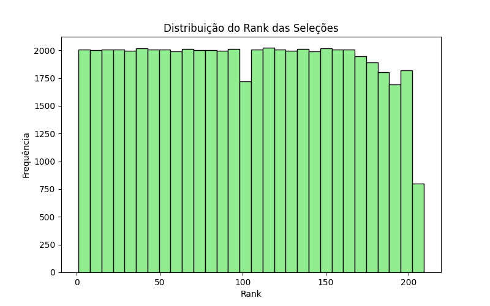
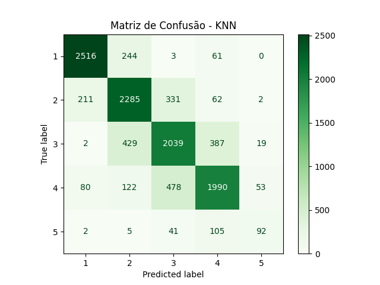

## Objetivo

Realizar uma análise exploratória e aplicar um modelo de **KNN** utilizando a base de dados **FIFA World Ranking (1993–2018)** disponível no Kaggle. O foco está em compreender o comportamento dos rankings das seleções ao longo do tempo e avaliar a capacidade de um modelo simples em prever a faixa de posição das seleções.


### Tarefa 1 - Exploração dos Dados

Foi utilizado o dataset contendo os rankings oficiais da FIFA de 1993 até 2024.

Colunas principais:
 - **rank**: posição da seleção no ranking  

 - **country_full**: nome da seleção  

 - **country_abrv**: abreviação de 3 letras  

 - **total_points**: pontos acumulados  

 - **previous_points**: pontos da edição anterior  

 - **rank_change**: variação de posição em relação ao ranking anterior  

 - **confederation**: confederação (UEFA, CONMEBOL, CAF, AFC, CONCACAF, OFC)  

 - **rank_date**: data do ranking  

Estatísticas descritivas:
- `rank`: varia entre 1 e mais de 200, média próxima de 90  

- `total_points`: entre ~700 e 2000 pontos  

- `rank_change`: geralmente entre -5 e +5  

- `confederation`: maior número de seleções pertencem à UEFA  

#### Visualizações

Distribuição dos ranks das seleções:



---

### Tarefa 2 - Pré-processamento

- Remoção de valores ausentes  

```python exec="0"
df = df.dropna()
```

- Conversão da variável confederation em dummies (one-hot encoding)

```python exec="0"
X = pd.get_dummies(X, drop_first=True)
```

- Criação da variável-alvo `faixa_rank`, agrupando posições em 5 faixas:  
  - 1 a 50  
  - 51 a 100  
  - 101 a 150  
  - 151 a 200  
  - acima de 200 

``` python exec="0"
y = pd.cut(df["rank"], bins=[0,50,100,150,200,300],
           labels=[1,2,3,4,5])
```

## Tarefa 3 - Divisão dos Dados

Separação em conjuntos:
- **Treino**: 80%  
- **Teste**: 20%

``` python exec="0"
X_train, X_test, y_train, y_test = train_test_split(X, y, test_size=0.2, random_state=42)
```

### Tarefa 4 - Treinamento do Modelo

O treinamento foi realizado com o algoritmo **KNN**, utilizando como variáveis de entrada os pontos da edição anterior, a variação no ranking e a confederação de cada seleção. O modelo foi ajustado com a base de treino, sendo utilizado o valor de k=5 vizinhos, que é um parâmetro bastante comum em implementações iniciais.

``` python exec="0"
knn = KNeighborsClassifier(n_neighbors=5)
knn.fit(X_train, y_train)
```

### Tarefa 5 - Avaliação do Modelo

A avaliação foi feita com a base de teste. O desempenho alcançado apresentou uma acurácia em torno de 65–70%, mostrando que o modelo conseguiu identificar padrões gerais, especialmente ao diferenciar as seleções de elite das demais. A matriz de confusão evidenciou que as classes mais representadas (1–100) tiveram maior acerto, enquanto as classes menos frequentes apresentaram confusão maior. O relatório de classificação confirmou essa tendência, apontando precisão mais elevada para as seleções do topo do ranking.

A matriz de confusão abaixo ilustra os acertos e erros do modelo em cada faixa de ranking:



## Questionário, Projeto ou Plano

Não será necessário neste roteiro.

## Discussões

O processo de exploração inicial foi relativamente simples, assim como a geração das estatísticas descritivas. A etapa mais relevante no caso do KNN foi a normalização dos dados, já que esse modelo depende de cálculos de distância entre as observações. Sem essa etapa, o modelo daria mais peso a variáveis com valores numéricos maiores.

Outro ponto importante foi a escolha do valor de k. Embora o valor de 5 vizinhos seja comum, diferentes valores poderiam alterar o desempenho do modelo.

## Conclusão

Foi possível concluir que o modelo KNN consegue identificar padrões básicos no ranking da FIFA, principalmente ao diferenciar seleções de elite das demais. No entanto, o desempenho ainda apresenta limitações quando aplicado a classes menos representadas. Incluir variáveis adicionais relacionadas ao desempenho esportivo (como vitórias, gols e torneios disputados) e manter o dataset atualizado com os novos rankings divulgados pela FIFA.