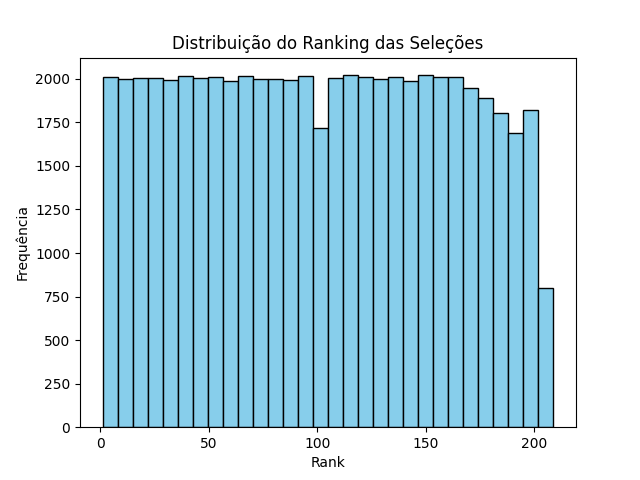
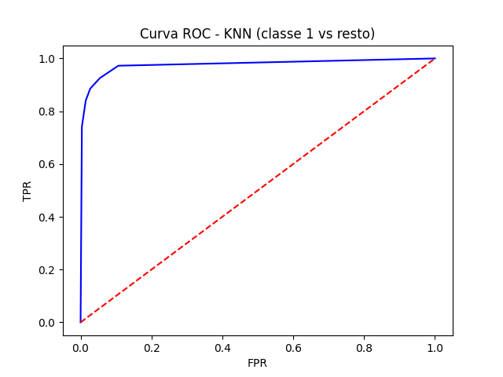
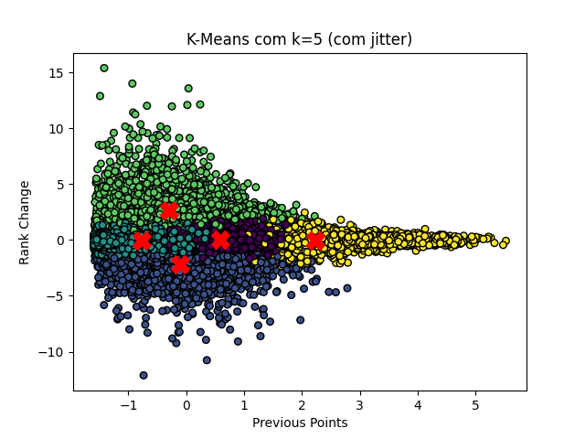

### Tarefa 1 - Exploração dos Dados

O dataset utilizado foi o FIFA Ranking disponível no Kaggle.
Ele contém informações históricas sobre seleções, incluindo pontos acumulados, variação de ranking e confederação de cada time.

Foram realizadas análises iniciais para verificar a natureza dos dados.

`df.info()` mostrou colunas numéricas (como previous_points, rank_change) e categóricas (confederation).

`df.describe()` trouxe estatísticas descritivas básicas.

Distribuição dos ranks das seleções:



### Tarefa 2 - Pré-processamento

- Remoção de valores ausentes  

```python exec="0"
df = df.dropna()
```

- Conversão da variável confederation em dummies (one-hot encoding)

```python exec="0"
X = pd.get_dummies(X, drop_first=True)
```

- Criação da variável-alvo `faixa_rank`, agrupando posições em 5 faixas:  
  - 1 a 50  
  - 51 a 100  
  - 101 a 150  
  - 151 a 200  
  - acima de 200 

``` python exec="0"
y = pd.cut(df["rank"], bins=[0,50,100,150,200,300],
           labels=[1,2,3,4,5])
```

## Tarefa 3 - Divisão dos Dados

Separação em conjuntos:

- **Treino**: 80%  
- **Teste**: 20%

``` python exec="0"
X_train, X_test, y_train, y_test = train_test_split(X, y, test_size=0.2, random_state=42)
```

### Tarefa 4 - Treinamento do Modelo KNN

O modelo escolhido do KNN foi com k=5 vizinhos.
Esse algoritmo classifica uma seleção de acordo com a maioria das classes dos vizinhos mais próximos.

``` python exec="0"
knn = KNeighborsClassifier(n_neighbors=5)
knn.fit(X_train, y_train)
y_pred = knn.predict(X_test)
```

### Tarefa 5 - Avaliação do Modelo KNN

As métricas utilizadas foram:

- **Acurácia**: proporção de acertos reais. => 0,77

- **Precisão**: quão corretas foram as predições positivas em todas as classes. => 0,73

- **Recall**: proporção de acertos em cada classe. => 0,69

- **F1-score**: equilíbrio entre precisão e recall. => 0,71

- **Matriz de Confusão**: erros e acertos por classe.

- **ROC-AUC**: capacidade do modelo em distinguir classes. => 0,97

``` python exec="0"
print("Acurácia:", accuracy_score(y_test, y_pred))
print("Precisão:", precision_score(y_test, y_pred, average="macro"))
print("Recall:", recall_score(y_test, y_pred, average="macro"))
print("F1-Score:", f1_score(y_test, y_pred, average="macro"))
print("\nMatriz de Confusão:")
print(confusion_matrix(y_test, y_pred))
print("\nRelatório de Classificação:")
print(classification_report(y_test, y_pred))

y_bin = (y_test == 1).astype(int)
y_pred_proba = knn.predict_proba(X_test)[:, 0]
roc_auc = roc_auc_score(y_bin, y_pred_proba)
print("ROC-AUC (classe 1 vs resto):", roc_auc)

fpr, tpr, _ = roc_curve(y_bin, y_pred_proba)
plt.plot(fpr, tpr, color="blue")
plt.plot([0,1],[0,1], color="red", linestyle="--")
plt.xlabel("FPR")
plt.ylabel("TPR")
plt.title("Curva ROC - KNN (classe 1 vs resto)")
plt.savefig("roc_knn.png")
plt.close()
```



### Tarefa 6 - Avaliação do Modelo K-Means

Como técnica não supervisionada, o K-Means foi utilizado para agrupar as seleções.
- Número de clusters definido: k=5

- Cada seleção foi atribuída a um cluster

- Foram calculadas estatísticas médias para cada grupo.

**Métricas:**

- **Silhouette Score**: 0,41 (indicando separação razoável entre os clusters).

A figura abaixo mostra a vizualização dos clusters encontrados.


### Tarefa 7 - Considerações Finais

- O **KNN** apresentou um desemprenho satisfatório (acurácia de 77%), mas ainda com confusões entre classes próximas de ranking.

- O **K-Means** conseguiu identificar grupos naturais de seleções com base em `previous_points` e `rank_change`, mas como o esperado em problemas não supervisionados, o desempenho é inferior ao modelo supervisionado.

Algumas possíveis melhorias que poderia ter seriam o ajuste do hiperparâmetros (k no KNN e número de clusters no K-Means), testar outras variáveis do dataset (como pontos acumulados ao longo do tempo) e aplicar técnicas de balanceamento de classes para melhorar recall em classes minoritárias.