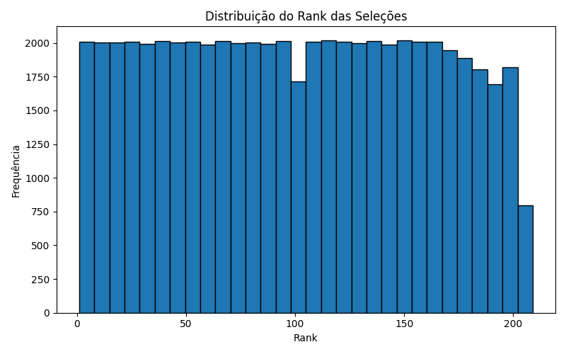

## Objetivo

Aplicar o algoritimo **PageRank** a um grafo construído a partir do ranking FIFA, onde cada seleção aponta para outra seleção melhor colocada dentro da mesma confederação

### Tarefa 1 - Exploração dos Dados

Foi utilizado o dataset contendo os rankings oficiais da FIFA de 1993 até 2024.

Colunas principais:
 - **rank**: posição da seleção no ranking  
 
 - **country_full**: nome da seleção  
 
 - **country_abrv**: abreviação de 3 letras  
 
 - **total_points**: pontos acumulados  
 
 - **previous_points**: pontos da edição anterior  
 
 - **rank_change**: variação de posição em relação ao ranking anterior  
 
 - **confederation**: confederação (UEFA, CONMEBOL, CAF, AFC, CONCACAF, OFC)  
 
 - **rank_date**: data do ranking  

Estatísticas descritivas:
- `rank`: varia entre 1 e mais de 200, média próxima de 90  

- `total_points`: entre ~700 e 2000 pontos  

- `rank_change`: geralmente entre -5 e +5  

- `confederation`: maior número de seleções pertencem à UEFA  

#### Visualizações

Distribuição dos ranks das seleções:



---

### Tarefa 2 - Pré-processamento

- Remoção de valores ausentes  

```python exec="0"
df = df.dropna()
```

## Tarefa 3 - Divisão dos Dados

Separação em conjuntos:
- **Treino**: 80%  
- **Teste**: 20%

``` python exec="0"
X_train, X_test, y_train, y_test = train_test_split(X, y, test_size=0.2, random_state=42)
```

### Tarefa 4 - Construção e Exploração do Grafo

Foi usada a base de dados do ranking da FIFA para a criação do grafo que modela a relação hieráquica entre seleções. Cada confederação (UEFA, CONMEBOL, CAF, AFC, CONCACAF, OFC) gera uma cadeiaordenada de seleções onde cada nó apresenta uma seleção e cada aresta aponta da pior seleção colocada para uma melhor colocada da mesma confederação.

```python exec="0"
df = df.sort_values("rank").reset_index(drop=True)
G = nx.DiGraph()

for _, row in df.iterrows():
    G.add_node(
        row["country_full"],
        rank=row["rank"],
        conf=row["confederation"],
        points=row["total_points"]
    )

groups = df.groupby("confederation")

for conf, group in groups:
    group = group.sort_values("rank")
    countries = list(group["country_full"])

    for i in range(1, len(countries)):
        G.add_edge(countries[i], countries[i-1])
```
#### Resumo da estrutura
Nós -> 210 seleções
Arestas -> uma cadeia por confederação

## Tarefa 5 - Implementação do PageRank

O critério de convergência adotado foi para parar quando a diferença média das interações for menor do que 0.0001, e foi utilizado como fator de amortecimento padrão **d = 0.85**.

**Implementação utilizada**

```python exec="0"
def pagerank_manual(G, d=0.85, tol=0.0001, max_iter=100):
    nodes = list(G.nodes())
    n = len(nodes)
    pr = {node: 1/n for node in nodes}
    
    for _ in range(max_iter):
        pr_new = {}
        for node in nodes:
            incoming = G.in_edges(node)
            s = 0
            for a, b in incoming:
                out_degree = G.out_degree(a)
                if out_degree > 0:
                    s += pr[a] / out_degree
            pr_new[node] = (1 - d)/n + d * s
            
        diff = sum(abs(pr_new[node] - pr[node]) for node in nodes)
        pr = pr_new
        if diff < tol:
            break
        
    return pr
```

## Tarefa 6 - Comparação com Networkx

Para realizar a validação da implementação, os valores foram comparados com:

``` python exec="0"
nx.pagerank(G, alpha=d)
```

Assim tivemos como resultado que as diferenças ficaram abaixo 0.0001, indicando que a implementação manual está correta e que o comportamento geral dos rankings é idêntico na ordenação dos nós.

## Tarefa 7 - Análise dos Nós mais importantes

Foram selecionados os 10 nós com maior **PageRank**, sendo os maiores pertencentes, em geral, das seleções melhores posicionadas e que ocupam o topo da cadeia da sua confederação. Como cada confederação forma uma cadeia linear, o topo de cada cadeia recebe um alto número de contribuições acumuladas e um PageRank mais elevado.

## Tarefa 8 - Impacto do Fator de Amortecimento

Os valores testados foram $d=0.5$, $d=0.85$, $d=0.99$, com isso, foi possível observar os seguintes comportamentos:
**d=0.5** obteve um PageRank mais uniforme, uma diminuição nas diferenças entre as seleções e a importância distribuída de forma menos hierárquica.
**d=0.85** teve um comportamento mais balanceado, diferenciou bem as seleções mais importantes sem exagerar e é o padrão mais utilizado na prática.
**d=0.99** os PageRanks ficaram extremamente concentrados e as seleções no topo das confederações dominaram completamente.

## Discussões

Os resultados obtidos mostraram-se coerentes com a estrutura de grafo criada, que modela cada confederação como uma cadeia ordenada. Isso levou à observação de que os nós (seleções) com o maior PageRank são, naturalmente, aqueles que não possuem arestas de saída (outgoing edges) para nós mais bem ranqueados. Verificou-se que quanto maior a confederação, maior é o PageRank do topo da sua cadeia. O grafo da FIFA, nesse sentido, funcionou bem para demonstrar os comportamentos esperados do PageRank. A implementação manual do modelo convergiu rapidamente (em menos de 20 iterações), e a sua validade foi confirmada através da comparação com a implementação da biblioteca NetworkX.

## Conclusão 

A aplicação do PageRank no ranking FIFA foi bem-sucedida, permitindo identificar as seleções mais influentes dentro do contexto da estrutura do grafo. O trabalho serviu para validar a implementação manual do algoritmo e possibilitou a observação de como o fator de amortecimento impacta os resultados, além de demonstrar as propriedades de centralidade em redes dirigidas. Como possíveis expansões futuras do trabalho, foram sugeridas a introdução de arestas entre confederações, o uso de pesos baseados em histórico de partidas, a criação de visualizações interativas do grafo e a comparação do PageRank com outras métricas de centralidade, como degree e betweenness.