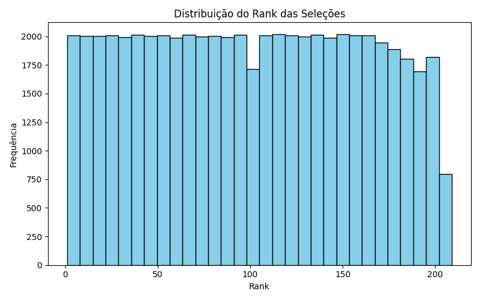
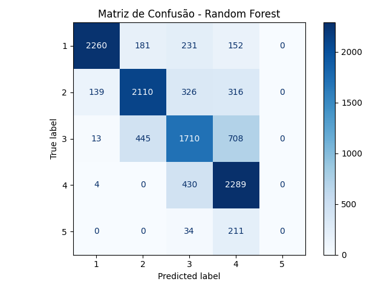
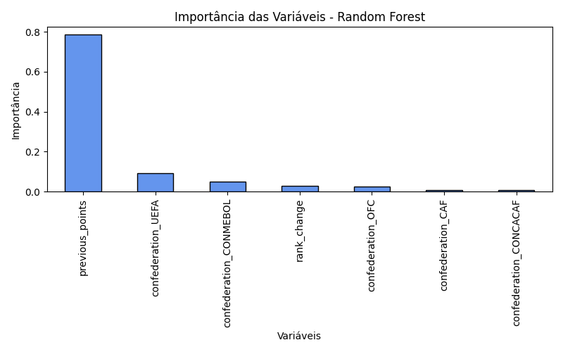

## Objetivo

Realizar uma análise exploratória e aplicar um modelo de **Random Forest** utilizando a base de dados **FIFA World Ranking (1993–2018)** disponível no Kaggle. O foco está em compreender o comportamento dos rankings das seleções ao longo do tempo e avaliar a capacidade de um modelo mais robusto em prever a faixa de posição das seleções.

### Tarefa 1 - Exploração dos Dados

Foi utilizado o dataset contendo os rankings oficiais da FIFA de 1993 até 2024.

Colunas principais:
 - **rank**: posição da seleção no ranking  
 
 - **country_full**: nome da seleção  
 
 - **country_abrv**: abreviação de 3 letras  
 
 - **total_points**: pontos acumulados  
 
 - **previous_points**: pontos da edição anterior  
 
 - **rank_change**: variação de posição em relação ao ranking anterior  
 
 - **confederation**: confederação (UEFA, CONMEBOL, CAF, AFC, CONCACAF, OFC)  
 
 - **rank_date**: data do ranking  

Estatísticas descritivas:
- `rank`: varia entre 1 e mais de 200, média próxima de 90  

- `total_points`: entre ~700 e 2000 pontos  

- `rank_change`: geralmente entre -5 e +5  

- `confederation`: maior número de seleções pertencem à UEFA  

#### Visualizações

Distribuição dos ranks das seleções:



---

### Tarefa 2 - Pré-processamento

- Remoção de valores ausentes  

```python exec="0"
df = df.dropna()
```

- Conversão da variável confederation em dummies (one-hot encoding)

```python exec="0"
X = pd.get_dummies(X, drop_first=True)
```

- Criação da variável-alvo `faixa_rank`, agrupando posições em 5 faixas:  
  - 1 a 50  
  - 51 a 100  
  - 101 a 150  
  - 151 a 200  
  - acima de 200 

``` python exec="0"
y = pd.cut(df["rank"], bins=[0,50,100,150,200,300],
           labels=[1,2,3,4,5])
```

- Normalização das variáveis numéricas

``` python exec="0"
scaler = StandardScaler()
X_scaled = scaler.fit_transform(X)
```

## Tarefa 3 - Divisão dos Dados

Separação em conjuntos:
- **Treino**: 80%  
- **Teste**: 20%

``` python exec="0"
X_train, X_test, y_train, y_test = train_test_split(X, y, test_size=0.2, random_state=42)
```

### Tarefa 4 - Treinamento do Modelo

O treinamento foi realizado com o algoritmo **Random Forest**, utilizando como variáveis de entrada os pontos da edição anterior, a variação no ranking e a confederação de cada seleção. O modelo foi ajustado com a base de treino, utilizando 100 árvores e profundidade máxima de 5. Foi ativado o parâmetro **OOB (Out-of-Bag)** para avaliação interna do modelo.

``` python exec="0"
rf = RandomForestClassifier(
    n_estimators=100,
    max_depth=5,
    oob_score=True,
    random_state=42
)
rf.fit(X_train, y_train)
```

O Random Forest combina várias árvores de decisão, tornando o modelo mais robusto frente a ruídos e outliers, e consegue capturar relações não lineares entre as variáveis.

### Tarefa 5 - Avaliação do Modelo

A avaliação foi feita com a base de teste. O desempenho alcançado apresentou uma acurácia 77%, mostrando que o modelo consegue identificar padrões gerais de forma consistente. A matriz de confusão evidencia que as classes mais representadas (1–100) tiveram maior acerto, enquanto as classes menos frequentes apresentam alguma confusão. O OOB score (≈ 78%) confirma que o modelo possui boa capacidade de generalização.

A matriz de confusão abaixo ilustra os acertos e erros do modelo em cada faixa de ranking:



A importância das variáveis também foi analisada:



- `previous_points`: maior influência no modelo  

- `rank_change`: média influência

- `confederation`: menor influência, mas relevante para algumas classes

### Tarefa 6 - Avaliação em função de número de árvores

A acurácia em treino e teste foi calculada variando o número de árvores de 1 a 100. O gráfico a seguir mostra como o modelo se estabiliza com o aumento das árvores, evidenciando convergência da acurácia e redução da variância:

## Discussões

O Random-Forest mostrou-se robusto, capturando padrões complexos no ranking da FIFA. A ativação do **OOB score** permitiu avaliar o modelo sem depender exclusivamente do conjunto de teste. 

# Pontos importantes:

- O modelo é menos sensível à normaização, mas esta ainda ajuda a manter consistência na escala das variáveis.

- A profundidade máxima das árvores influencia diretamente a capacidade de generalização. Profundidades maiores podem aumentar a acurácia no treino, mas causam overfitting.

- Variáveis categóricas como confederação têm menor peso, mas podem ajudar a diferenciar seleções de regiões específicas.

## Conclusão

O Random-Forest conseguiu identificar padrões complexos e generalizar bem para as novas observações. Possíveis melhorias incluem:

- Testar diferentes valores de profundidade e número de árvores.

- Incluir variáveis adicionais relacionadas ao desempenho esportivo, como gols marcados, vitórias e torneios disputados.

- Considerar técnicas de balançeamento de classes para melhorar a previsão das faixas menos representadas.